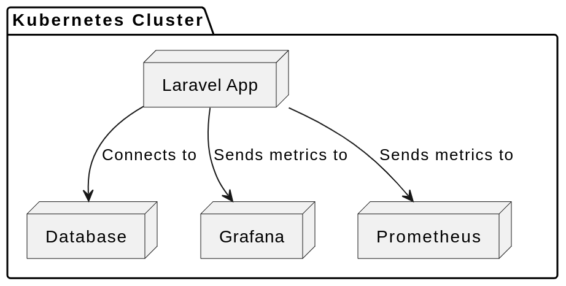

## Laravel App - CRUD Services 

This application run the service of Laravel CRUD Application with the database server. Include with the monitoring services using Prometheus and Grafana.

The application it self contain of : 
- Laravel Apps Directory
- Dockerfile and Docker compose script
- Helm chart for deploying locally
- Github Actions Workflow

The configuration of the deployment to Kubernetes, it's using such as: 
- Health Checks
- Horizontal Pod Autoscaling; While the container down, there are some backup to make the pods running up again.

The monitoring setup with the Helm chart using Prometheus and Grafana, which that also could monitor the Laravel apps
Default of the dashboard itself using Laravel App Metrics.

The monitoring process its using the default of Kubernetes system, with health checks to show the process of the pods itself

To run this app, you can try with: 

`helm install <name of the app> .`

If you want to run separately, such as to work with the container itself and database container, you can try with: 

`docker pull mrfzy00/crud_laravel_api-sre-test-app:latest`  
`docker run -d -p 8000:8000 --name <the container name> crud_laravel_api-sre-test-app`

Or you would try with run the app combined with docker compose its okay

To run the database you can start:
`docker-compose up -d`

The database will start the service itself

